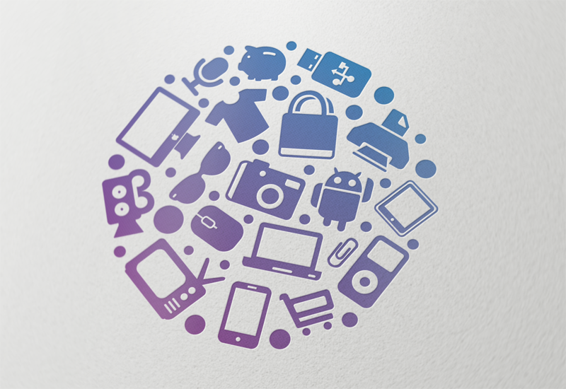

# Tech Store Client

</a>

This is the client-side component of the Tech Store project. <a>https://github.com/AnatoliyVinokurov/online-store-server</a> The client is built using JavaScript, React, and leverages React Router DOM for routing. It provides a user-friendly interface to interact with the Tech Store server, allowing users to browse and shop for tech devices, manage their baskets, and more.

## Table of Contents

- [Project Structure](#project-structure)
- [Key Features](#key-features)
- [Getting Started](#getting-started)
- [Configuration](#configuration)
- [Usage](#usage)
- [Contributing](#contributing)
- [License](#license)

## Project Structure

The client-side project structure is organized to ensure maintainability and modularity:

### `src`

- `components`: Contains reusable UI components used throughout the application, such as product listings, shopping baskets, and user authentication.
- `pages`: Defines the main pages of the application, including home, product details, shopping basket, and user authentication pages.
- `services`: Encapsulates client-side services for making API requests to the server. For example, user registration and login services.
- `routes`: Specifies the routing configuration using React Router DOM. It maps routes to their respective components.
- `styles`: Houses CSS and styling files for the client application.
- `utils`: Contains utility functions, helper methods, and constants used across the application.
- `assets`: Stores static assets like images, logos, and fonts.
- `config`: Manages configuration files or constants related to the client application.

## Key Features

The client-side application provides several key features to enhance the user experience:

- **User Authentication**: Users can register and log in to access their shopping baskets and enjoy personalized experiences.

- **Product Listings**: Browse and search for a wide range of tech devices, complete with images and detailed information.

- **Product Details**: View detailed information about a specific product, including images, specifications, and user ratings.

- **Shopping Basket**: Add and remove products from your shopping basket, view the contents, and proceed to checkout.

- **Responsive Design**: The client application is designed to work seamlessly on various devices, including desktops, tablets, and mobile phones.

- **User Profile**: Users can view and manage their profiles, including contact details and account settings.

- **Search Functionality**: Search for products by brand, type, or keywords.

- **Pagination**: Navigate through multiple pages of product listings.

- **Error Handling**: Provides informative error messages and a user-friendly interface for handling errors.

## Getting Started

1. Clone this repository to your local environment.

2. Install the required dependencies using the following command:

   ```bash
   npm install
   ```

3. Configure the client application based on your server's API endpoint. Update the API URL in the `services/api.js` file to match the server's address.

   ```javascript
   const API_URL = '---';
   ```

4. Run the client application using:

   ```bash
   npm start
   ```

5. Open your web browser and navigate to the specified development server address (e.g., `http://localhost:3000`).

## Configuration

The client application relies on environment variables for certain configurations. These variables can be set in an `.env` file in the project's root directory.

Example `.env` file:

```env
REACT_APP_API_URL=http://your-server-api-url-here
REACT_APP_BRANDS_LIMIT=10
REACT_APP_TYPES_LIMIT=10
```

- `REACT_APP_API_URL`: Set this variable to the URL of your Tech Store server.

- `REACT_APP_BRANDS_LIMIT` and `REACT_APP_TYPES_LIMIT`: Configure the number of brands and types to display on listing pages.

## Usage

The Tech Store client provides an intuitive and user-friendly interface for customers to explore and shop for tech devices. Users can register, log in, and browse a wide range of products, adding them to their shopping basket for easy checkout.

For developers, the codebase is organized and structured for easy maintenance and scalability. You can further customize and enhance the application to meet your specific requirements.

## Contributing

Contributions to this project are welcome! If you have ideas for improvements, new features, or bug fixes, feel free to open an issue or submit a pull request. Collaborative efforts are encouraged.

## License

This project is licensed under the [MIT License](LICENSE). You are free to use, modify, and distribute it as per the terms of the license.

For questions, issues, or collaboration inquiries, please feel free to contact the project owner or contribute through GitHub.

Happy shopping and coding!